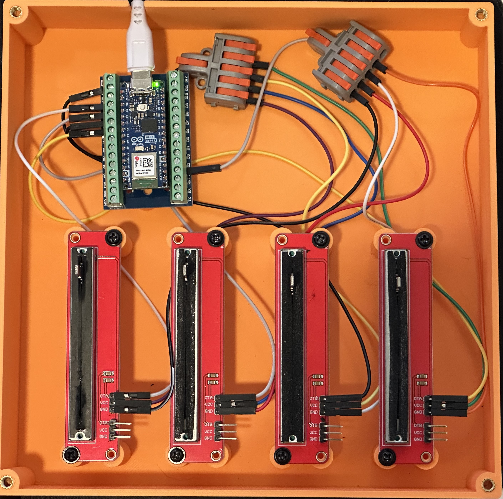

# CURRENTLY UNDER DEVELOPMENT
This project is currently under development and is subject to change.

:x: Get Master Volume Working\
:heavy_check_mark: Get Application Volume Control Working\
:heavy_check_mark: Tested on Windows\
:x: Tested on Mac\
:x: Tested on Linux

### Goals of  the Project
1. Open Source hardware and software
2. No soldering required
3. Easy control of application volume
4. Customizable 
## Volume Slider Box

A minimal python program that communicates with an Arduino Nano running a sketch that measures the value of a given
number of potentiometers. It then reports those values over a serial port to a python program which then controls the
 of your configured applications.

The current design is 192.5mm x 192.5mm x 44.5mm

## Setup (Still Under Construction)
> You will need a 3d printer to make the box

### Software
1. [Python](https://www.python.org/downloads/)
2. [Arduino IDE](https://www.arduino.cc/en/software)
3. Slicer Program for your 3d printer, 
   1. I use [Bambu Studio](https://bambulab.com/en/download/studio)
   2. Another good one is [Orca Slicer](https://github.com/SoftFever/OrcaSlicer)

### Hardware
Feel free to substitute hardware as you see fit, however other parts probably won't fit the current design.

1. [Slider Potentiometer](https://www.amazon.com/dp/B0D2L6LJXC?psc=1&ref=ppx_yo2ov_dt_b_product_details)
2. [Arduino Nano](https://www.amazon.com/Arduino-Nano-Every-headers-Mounted/dp/B07WWK29XF/ref=sr_1_1?crid=168ZUYOMRKRR2&dib=eyJ2IjoiMSJ9.LWBZoWBHsaivlvmKMQtyh8aVmGqwhO_Uv02Fkr2rtnxyujYzfqH9yr56FkWI4avqj3p1KnYchWR0ldi-xuH6ancgnyWpzNHx6i3OvDBzUWydQyIrU9a0xOPJK86aYnqFbm2I5VYH0hKh4Sqnq2qP6KPeVyF5u-qXeMKngBzFeCQQmCEITSOzZXoKWDMNDzdII6v01uIvBZO_v3NHnadwJiXPNZN6UxfBNHwz1-HkWFc.SRVM0ohIEqW_A2jvBji0uXz2fVqxpcV_TozOnLXJs-w&dib_tag=se&keywords=arduino%2Bnano+with+headers&qid=1721949526&sprefix=arduino%2Bnano+with+header%2Caps%2C141&sr=8-1) (there are cheaper options)
3. [Arduino Carrier Board](https://www.amazon.com/dp/B0B4Z7NJ9J?ref=ppx_yo2ov_dt_b_product_details&th=1) (pack of 6)
   1. Haven't tested [these](https://www.amazon.com/NOYITO-Terminal-Adapter-Arduino-ATMEGA328P-AU/dp/B07CBSMQ6T/ref=sr_1_11?crid=NPC0ZSFQI7FN&dib=eyJ2IjoiMSJ9.l6nimXctZz9Wf_Soh66VqO1kvJZNXapVhnioU2CWXjpa5nt6hjQ0IyPlsSNqVZPqpbfem1YC5cmJUsTGNA1OkT2f4-CSnEy9dKq_wMYX3I2fshni0TsXDGZ7nQCKI90w6FeBEACu8Dq22OCt48I0raPOeBPW9dOvVDtcIQNJHWBMJQ58vr9ubUFtj5LSAGPp5gtzY1rI8XP7q9GT3hzJ6i_YCJ-cFkDDg3egfYo02S8Zly2E84oIv8Rfit2_P6Lpp80j5AfCea9ZVFB7RJJtDcaMePTvVA3bQu5wYEkgSmw.JkVXJp4X6cSW-ByK5PBm_eCB0XrBhDiIiPWaJP8HYqA&dib_tag=se&keywords=arduino+nano+carrier+board&qid=1721949629&s=industrial&sprefix=arduino+nano+carrier+boar%2Cindustrial%2C117&sr=1-11) for size but pack of 2
4. [Toggle Button](https://www.amazon.com/dp/B0C61WY1JM?ref=ppx_yo2ov_dt_b_product_details&th=1) (optional)
5. Pack of [Wires](https://www.amazon.com/dp/B089FZ79CS?ref=ppx_yo2ov_dt_b_product_details&th=1) (feel free to find a smaller set)
6. [Wire Connectors](https://www.amazon.com/dp/B09VSYG3H5?ref=ppx_yo2ov_dt_b_product_details&th=1)
7. 4 M4x8mm Machine Screws
8. 4 M4 Threaded Inserts (M4x5mmx5mm)(Thread, Diameter, Height)
   1. If you don't want to heat press the threaded insert you can try using a M5 plastic screw something like [this](https://www.mcmaster.com/90380A386/) 

### Wiring it up

## Files
- See the [assets](assets) folder for the step files for the 3d printed parts
